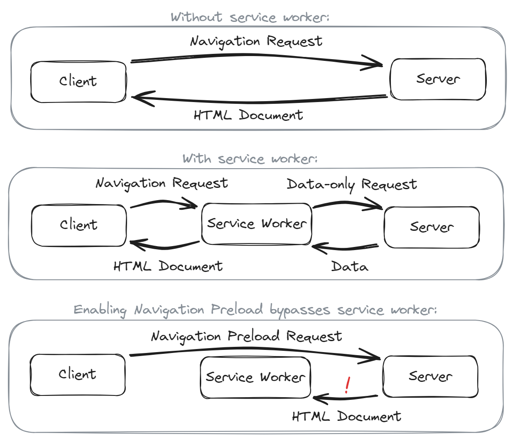

<h1 class=nocount>Table of Contents</h1>

{{TOC}}

<style>
.TOC > ul > li:nth-child(7)::after {content: '\a\a\a\a\a\a\a\a'}
.TOC > ul > li:nth-child(-n+4),
.TOC > ul > li:last-child {counter-increment: none;}
.TOC > ul > li:nth-child(-n+5)::before,
h1:nth-of-type(-n+5):not(:first-of-type) {counter-increment: none; height:0;visibility:hidden;position:absolute;top:-10000px;}
.TOC > ul > li:nth-child(-n+3)::after {content: none}
.TOC > ul > li::after {content: '\a'; white-space:pre;}
</style>

# List of Figures<i num=i>
# List of Tables <i num=ii>
# List of Abbreviations and Acronyms <i num=iii>
# Declaration of Academic Integrity <i num=iv>
+++
# Introduction
## Background <i num=1>

Web applications are a crucial component of the digitalized landscape, playing a vital role in areas such as communication, access to health care [^healthcare] or political participation [^evoting]. There are different architectural paradigms used to develop web applications. Multi-page application (MPA) architecture has been in use ever since the invention of the world wide web in 1993. Later, new technical developments and innovative applications led to the rise of single-page application (SPA) architecture [^what_is_mpa] [^ajax_approach]. A third approach, often called hybrid or isomorphic rendering, attempts to combine the advantages of MPA and SPA architecture. Each architectural approach has different traits relating to performance, interactivity, developer convenience or infrastructure requirements [^iso_book].

[^healthcare]:	U.S. Centers for Medicare & Medicaid Services, HealthCare.gov Enrollment Exceeds 15 Million, Surpassing Previous Years’ Milestones, 2023. Accessed: Mar. 4, 2024. [Online]. Available: https://www.cms.gov/newsroom/press-releases/healthcaregov-enrollment-exceeds-15-million-surpassing-previous-years-milestones
[^what_is_mpa]: S. Moses, "What is a multi page application," Oh My Crawl, 23 Feb., 2022. Accessed: Mar. 5, 2024. [Online]. Available: https://www.ohmycrawl.com/faq/what-is-a-multi-page-application/
[^ajax_approach]: J. J. Garrett, "Ajax: A New Approach to Web Applications," Adaptive Path, 2005. [Online]. Available: https://courses.cs.washington.edu/courses/cse490h/07sp/readings/ajax_adaptive_path.pdf
[^evoting]: U. Geiser, "E-voting to be introduced permanently," SWI swissinfo.ch, 27 Jun., 2018. Accessed: Mar. 5, 2024. [Online]. Available: https://www.swissinfo.ch/eng/politics/direct-democracy-online_e-voting-to-be-introduced-permanently/44219770
[^iso_book]: E. K. Gordon, Isomorphic web applications: Universal development with React. Shelter Island, NY: Manning Publications, 2018. [Online]. Available: https://learning.oreilly.com/library/view/-/9781617294396/?ar

One key factor for the success, reach and accessibility of a web application is its performance. Especially in regions where devices and data connections tend to be slower, performance can be the limiting factor that hinders users from accessing the services that the web applications are meant to provide. Unfortunately, single-page applications, which have been the prevalent architecture for new web applications in the past decade, tie application performance directly to the power of users' end devices, as all application code is executed locally on the device as opposed to the application server. On devices with limited computing power, performance characteristics of single-page applications end up lacking. Critics claim that single-page applications sacrifice speed and accessibility for developer convenience, thereby limiting the reach and inclusiveness of services offered on the web. At the same time, multi-page applications are criticized for improving initial load times but limiting the responsiveness and richness of the experience during ongoing use [^spa_theory_practice]. Isomorphic applications promise to solve some of these problems but have downsides, too, especially when it comes to implementation complexity and infrastructure requirements [^iso_paper] [^iso_book]. 

[^spa_theory_practice]: N. Lawson, "SPAs: theory versus practice," Read the Tea Leaves, 2022. [Online]. Available: https://nolanlawson.com/2022/06/27/spas-theory-versus-practice/
[^iso_paper]: A. Huotala, "Benefits and Challenges of Isomorphism in Single-Page Applications: A Case Study and Review of Gray Literature," Master Thesis, University of Helsinki, Helsinki, 2021. [Online]. Available: https://helda.helsinki.fi/server/api/core/bitstreams/d5b170ee-076f-4a79-8173-86b35c4774df/content

Thus, there is demand for alternative architectures that allow for rich web applications which perform well on low-end devices with unstable data connections, both during initial load and ongoing use. One such alternative was proposed in 2016, then elaborated on in more detail in 2018 by Jeff Posnick, developer on the Google Chrome team. According to Posnick, the combination of HTML partials, service workers and the Stream and Cache APIs (explained in chapter 2.4.1 *Technical Foundations*) should enable a fast, app-like user experience even for pages that are authored as multi-page applications. To achieve this, the service worker utilizes a technique called stream stitching to combine a cached HTML shell with HTML retrieved from a server into a single response that is both fast and contains up-to-date content [^posnick_stream] [^posnick_shell].

[^posnick_stream]: J. Posnick, "Stream Your Way to Immediate Responses," Chrome for Developers, 2016. [Online]. Available: https://developer.chrome.com/blog/sw-readablestreams/
[^posnick_shell]: J. Posnick, "Beyond SPAs - alternative architectures for your PWA," Chrome for Developers, 2018. [Online]. Available: https://developer.chrome.com/blog/beyond-spa/

This paper examines the advantages and disadvantages of the architectural approach suggested by Posnick. It determines the performance characteristics of the proposed architecture and compares them to other architectural approaches as well as to performance goals proposed by research on User Experience.

For this purpose, a demo application is developed in multiple variants. For each architectural paradigm to be compared, a variant of the app is created, whereby the variants match as far as possible in order to ensure comparability. The variants are all derived from a single codebase, only the logic concerned with rendering, routing and caching differ between them. The established web performance testing service webpagetest.org is used to run tests and collect data for key figures such as file sizes or performance metrics like *Render* or *Visual Complete* [^metrics_wpt]. The tests are run in an environment that simulates slow hardware and network connection conditions. The data obtained in this way is then analyzed in order to draw conclusions about the advantages and disadvantages of the investigated web app architecture paradigms. In addition to the experiment, a literature analysis is carried out to shed light on the technologies that are required to implement the different architectures.

[^metrics_wpt]: WebPageTest Documentation. "Page-Level Metrics." Accessed: May 10, 2024. [Online]. Available: https://docs.webpagetest.org/metrics/page-metrics/

## Document Structure <i num=2>

The thesis is structured according to the following pattern: Chapter 1, *Introduction*, establishes the research questions and provides background and context to help understand their relevance. Chapter 2, *Fundamentals*, then explains the characteristics, advantages and disadvantages of multi-page, single-page and isomorphic architecture styles based on a review of gray literature, as published research on the topic is sparse. It also introduces App Shell architecture: First, core technologies necessary to implement it are introduced, namely Service Workers, Streams and Cache. Next, the functioning principle is explained and theoretical advantages and disadvantages are presented. Chapter 3, *Methods*, then introduces the methods that were used to achieve the research goals as outlined in chapter 1. It describes the example application, the technology that was used to develop it and how core implementation problems were solved. The following sub-chapter *Data Collection* introduces the testing procedures, followed by sub-chapter *Data Analysis*, which explains how the collected data is used to draw conclusions about the performance of the various application architecture paradigms. Finally, chapter 4, *Results*, presents the outcome of this research project. The developed example application and the collected performance data is presented and visualized. After a discussion in chapter 5, *Discussion*, the thesis is finally concluded in chapter 6, *Conclusion and Outlook*.

+++
# Fundamentals
## Multi-Page Applications <i num=3>

In multi-page applications, the HTML document is rendered on the server. Each time a user goes from one page to another, a new request is sent to the server, which then generates the HTML document for the requested page. The resulting HTML document is processed in the browser and displayed in a new *browsing context*. The page accessed in this way therefore does not adopt any changes or data from the previous website, with the exception of explicitly persistently stored data. This so-called *request/response cycle* underlies almost every interaction and navigation of a multi-page application [^what_is_mpa].


As Philip Schmitt lays out in his extensive article on developments in frontend architecture, published in the journal *dotnetpro*, this mode of operation has both positive and negative characteristics [^dotnetpro_frontend]. On the positive side, client-side program code can be reduced, as the loaded website only represents a single view and is not responsible for the entire functional scope of the web application. The browser therefore has to download and process less code, which has a positive effect on speed. The complexity of the program code executed in the browser can also be kept low, as there are fewer states and exceptions to consider. Another factor that gives multi-page applications an advantage in terms of loading speed is that web browsers' loading processes for HTML documents have been extensively optimized over decades. All current browsers use a *streaming parser* that can start processing and analyzing an HTML document even before the transfer is complete. In addition to the synchronous execution of the HTML code, which has to wait for elements like embedded script segments, a second process scans the document for resources used, such as images or style sheets, so that these can be retrieved even before the regular program code execution has reached the referencing section [^browser_streaming]. Other optimizations such as pre-fetching and the backward/forward cache (*bfcache*) can also speed up the loading process, so that HTML generated on the server is clearly superior to client-side generated documents when a document is initially loaded [^bfcache]. Moving code and responsibility to the server can be seen as an advantage in that the server is a controlled environment in terms of both software and hardware, whereas performance, runtime environment and other characteristics of end devices vary greatly. Source code that is executed on end devices therefore means an inherently higher risk of errors and performance problems compared to server-side code.

[^browser_streaming]: E. Goldstein. "Exploring Web Rendering: Streaming HTML." Accessed: Jan. 15, 2024. [Online]. Available: https://www.babbel.com/en/magazine/exploring-web-rendering-streaming-html
[^bfcache]: C. Crocker. "Navigate your way to better performance with prerendering and the bfcache." Accessed: May 9, 2024. [Online]. Available: https://www.speedcurve.com/blog/bfcache-prerendering/

At the same time, the architectural approach of multi-page applications also has significant disadvantages. As interaction and navigation are associated with the loading of a new HTML document, changes and states of the previous document are discarded. This does not apply to all states: in some cases, the browser automatically restores specific properties after the new document has been loaded. For example, the scroll position of the main document and entries in fields of a form are restored. However, this automatic recovery performed by the browser is very limited. It only covers a small part of the possible state changes: only the scroll position of the main document is restored, but not that of other scrollable elements such as a sidebar. The state of collapsible elements and numerous other interface components is also lost. Beyond that, this automatic restoration is limited to forward/backward navigation that is prompted by the corresponding forward/backward buttons in the browser interface or by the `back()` method that is exposed to JavaScript as part of the History API. Navigation that is prompted by hyperlinks or the submission of forms is *not* covered by this automatic recovery. A *Back* button that does not call the `back()` method via JavaScript, but is implemented as a hyperlink that links to the previous page, does load the previous website when clicked on, but the backward navigation is accompanied by a loss of all transient states. The retention of states can be implemented manually using a combination of persistent memory and special JavaScript code, but this is time-consuming and is rarely implemented comprehensively.

 and the state of the expandable info texts (right) are reset.")

Another limitation resulting from loading a new document every time a navigation or interaction takes place concerns animated page changes, so-called *Page Transitions*. It is almost impossible to implement these with a pure MPA architecture, which is why all web applications that want to use page transitions integrate some form of hybrid approach between MPA and SPA architecture, such as turbolinks (see chapter 2.3. Isomorphic Applications), or rely on a SPA architecture from the outset. A solution to this problem is in the works; the *View Transition API* that was introduced in 2023 and currently only works for same-document navigations is to be extended so that it also works for MPA navigations that load a new document [^mpa_spa_viewtrans_navig]. However, this extension is experimental and the problem remains until it is finalized and available in all major browsers. The strong dependence on a server to render and supply HTML also constitutes a technical hurdle for implementing offline functionality in a multi-page application, as the server is not reachable when a user is offline.  Loading a new document with every navigation also means that scripts for analysis or advertising purposes, which are required on every page, are executed anew each time, which can have a negative impact on the loading speed. Outsourcing code and responsibilities to the server, which offers the advantage of a controlled runtime environment, can also come with disadvantages. Since most applications still need some client-side code, even if the majority of their logic is implemented on the server, the application code ends up distributed across two separate codebases, often written in different programming languages: JavaScript for the client-side code, and an arbitrary other language for the server-side code. This means that changes and features cannot be implemented in one place using one programming language, but must be coordinated and implemented in two codebases, increasing the development complexity [^dotnetpro_frontend].

[^dotnetpro_frontend]: P. Schmitt, "Die Zukunft des Frontends: Aktuelle Entwicklungen auf dem Spektrum zwischen Single Page Application und Multi Page Application.," dotnetpro, 14 Nov., 2022. [Online]. Available: https://www.dotnetpro.de/frontend/zukunft-frontends-2810967.html
[^mpa_spa_viewtrans_navig]: O. Williams. "The View Transitions API, the Navigation API and the SPA vs MPA debate." Accessed: Jan. 15, 2024. [Online]. Available: https://fullystacked.net/the-spa-vs-mpa-debate/

## Single-Page Applications <i num=5>

In applications built according to the SPA paradigm, an HTML document is only delivered by the server for the first page request. This document does not yet contain any content, but merely contains the instructions required to load JavaScript code on the client side. On the client, the JavaScript code will run and dynamically insert all content that's part of a given page into the loaded document. No matter whether a user navigated to the URL `/about` or to `/products`, the same empty HTML document is sent by the server and loaded in the browser, but then the JavaScript code on the client will insert headings, images and text in one case and a list of products in the other. That same JavaScript code will also handle all subsequent interactions and navigations by dynamically adjusting the loaded document. This means that once the necessary JavaScript code is downloaded and executed, a single-page application runs on the client and can render the user interface and switch pages without talking to a server [^dotnetpro_frontend]. If data is required, the application running on the client requests it from the server via *Ajax*. The server then delivers the requested information in the form of structured data, usually in *JSON* format, more rarely as *XML*. The client-side JavaScript code is responsible for consuming data and creating a visible representation that can be added to the document. The rendering of HTML therefore takes place exclusively on the client, the server only acts as a decoupled API to supply raw data [^ajax_approach].

Since a navigation does not have to wait for a request to a server, it can take place without the latency associated with such a network request. Page changes can be fast, comparable in speed to a native application. Since all interaction and navigation flows are fully controlled by client code instead of delegating the loading of the new page to the browser, more complex navigation patterns and interactions can be implemented. For example, the accessed page can be displayed as a modal above the previous page. Navigation can also be enhanced with View Transitions, effects that animate the transition from one page to the next. Combined with the advantage that the state of the application is not lost during navigation and the fact that implementation of offline experiences is more practical, it can be said that single-page applications can offer a more convincing "app-like user experience" compared to multi-page applications. In addition to the user experience, the developer experience is also advantageous when developing single-page applications. A fundamental advantage is that the entire front end can be implemented in one code base instead of being distributed across two projects on the client and server side. Modern frameworks use this to enable an integrated development experience that shows changes in real time thanks to functions such as *Hot Module Reload* and allows fast feedback loops. The convenience of the developer experience and the pursuit of a user experience comparable to native applications led to a rapid increase in popularity and made the SPA paradigm the standard architecture for modern web applications [^dotnetpro_frontend].

However, this architecture has numerous disadvantages. Visibility in search engines is limited with single-page applications, as many search engines only inspect the transmitted HTML, which does not contain content in single-page applications, and do not execute scripts. This used to apply to all search engines, but now major search engines such as Bing [^bing_seo] and Google execute scripts. Nevertheless, disadvantages remain: as indexing websites that require scripts involves more effort for the search engines, content is updated less frequently. In addition, not all dynamically inserted content is detected [^js_seo].

Various factors contribute to the fact that page changes are fast, but the performance of a single-page application suffers. This starts when the page is first loaded. Instead of receiving a finished HTML document via stream, the loading process starts with an empty HTML document that references a large amount of JavaScript code. After receiving the document, this is downloaded, parsed and then executed. Structured data required for rendering the first page is often retrieved via Ajax as part of the first execution. The browser can only display the first page once this data has been transferred and the execution of the JavaScript has been completed. To make matters worse, the loading of JavaScript and structured data usually does not work in a streamed manner, as is the case with HTML documents, which leads to a further slowdown [^rendering_on_web].

[^rendering_on_web]: Addy Osmani and Jason Miller, "Rendering on the Web," web.dev, 2019. [Online]. Available: https://web.dev/articles/rendering-on-the-web#streaming_server-side_rendering_and_progressive_rehydration

<style>img[src*="spa_flow"] {max-width: 200px}</style>


The loading speed is also heavily dependent on the performance of the end device, which can vary greatly. For example, the performance of a Samsung Galaxy A23, an affordable and popular mid-range end device with the Android operating system from 2022, is comparable to the performance of the iPhone 6, which was released in 2014 [^perf_gap_2023].

[^perf_gap_2023]: A. Russell, "The Performance Inequality Gap, 2023," Alex Russell, 19 Dec., 2022. Accessed: May 12, 2024. [Online]. Available: https://infrequently.org/2022/12/performance-baseline-2023/

In addition to performance issues, offloading code execution can also lead to resilience issues. Browser extensions such as ad blockers, outdated versions or unstable network connections can lead to the JavaScript code not executing successfully. A multi-page application that only uses client code according to the principle of *progressive enhancement* can continue to run under these conditions, whereas a single-page application runs a high risk of no longer working at all.
Since many basic application mechanisms such as navigation, which traditionally rely on a ready-made mechanism provided by the browser, have to be implemented manually in the app code in a single-page application, the complexity of the source code of a single-page application is often higher than that of a multi-page application. This can neutralize the advantage that the entire front end can be developed in a uniform codebase, so that the single-page application still has a higher development effort overall. As a result, the potential offered by the architecture of a single-page application is rarely exploited. Only a few applications developed according to this pattern offer fast performance and take into account and use the possibilities of modern APIs, for example to implement an offline experience [^spa_theory_practice].

[^bing_seo]: F. Canel. "The new evergreen Bingbot simplifying SEO by leveraging Microsoft Edge." Accessed: Jan. 15, 2024. [Online]. Available: https://blogs.bing.com/webmaster/october-2019/the-new-evergreen-bingbot-simplifying-seo-by-leveraging-microsoft-edge
[^js_seo]: D. Sharp, "Is Bing Really Rendering & Indexing JavaScript?," Screaming Frog, 13 Jun., 2018. Accessed: Jan. 15, 2024. [Online]. Available: https://www.screamingfrog.co.uk/bing-javascript/

+++
## Isomorphic Applications <i num=8>

Since both SPA and MPA architecture comes with numerous disadvantages, as explained in the previous chapters, efforts were made early on to optimize these or develop new hybrid approaches that combine the advantages of the two architectural styles.  [^ajax_approach] One approach is to take a traditional multi-page application and enhance it with JavaScript that detects clicks on links, prevents the resulting navigation and instead downloads the new HTML document and inserts it into the current page. This can improve performance and allows for features such as page transitions or persistent elements that are otherwise not supported in multi-page applications. The technique was introduced by the library *pjax*, first released in 2011 [^pjax], then further popularized by *turbolinks*, part of the established framework *Rails*, which powered large web applications such as *gitlab.com* [^gitlab_turbolinks]. A newer approach that has continually gained popularity over the past years is isomorphism. Instead of enhancing a multi-page application that's rendered on the server by adding additional, decoupled client-side functionalities, isomorphic applications take SPA architecture and add a server-side runtime. This way, the identical declarative JavaScript code can be executed on the server and on the client, outputting HTML when run on the server and resulting in targeted same-document interactions when run on the client [^what_is_iso]. This mode of rendering is therefore sometimes titled *isomorphic rendering* or *universal rendering*. Isomorphism is occasionally described as a subspecies of SPA architecture, but for the purpose of this research, it will be regarded as its own architectural paradigm and referred to as *isomorphic applications* [^iso_paper].

[^gitlab_turbolinks]: J. Schatz, Our big Frontend plan revealed, 2017. Accessed: May 9, 2024. [Online]. Available: https://about.gitlab.com/blog/2017/02/06/vue-big-plan/
[^pjax]: C. Wanstrath, "defunkt/jquery-pjax," GitHub Repository, 26 Feb., 2011. Accessed: May 9, 2024. [Online]. Available: https://github.com/defunkt/jquery-pjax/tree/3efcc3c968c18c4deeb27a1bab1b7306ca4b6e99
[^what_is_iso]: J. NR, "What is an isomorphic application?," Lullabot, 10 Jun., 2015. Accessed: May 9, 2024. [Online]. Available: https://www.lullabot.com/articles/what-is-an-isomorphic-application

When the web application is initially loaded, the application code runs on the server and creates a fully rendered HTML document for the initial view, which can be streamed to the browser. At this point, the isomorphic application behaves like a multi-page application, utilizing server-side rendering to output the initial view. On the client, the isomorphic application starts to behave like a single-page application, executing JavaScript code that is able to handle navigations and interactions within the already loaded document. While for the single-page application this JavaScript code had to retrieve content, then render and display the initial view, in the case of the isomorphic application the JavaScript code takes the rendered view that is already there and adds JavaScript instrumentation to handle any *future* navigations. It takes a static HTML document that was already rendered by the server and "upgrades" it to a dynamic single-page application, able to perform future renders without relying on the server. This process is called *hydration* [^iso_book].

For the initial load, isomorphic applications have similar advantages as multi-page applications. Much of these revolve around improved performance, as the first request is immediately answered through a fully rendered HTML document which the browser can stream and display, while single-page applications have to load the initial document, download and execute JavaScript, retrieve the requested content and wait for the JavaScript code to display it. But other benefits of MPA architecture apply to isomorphic applications, too, such as search engine crawlers being able to easily retrieve content to inspect and add it to their search index. Running on the server can also be advantageous in terms of development convenience. For example, accessing a database without an intermediary is possible from server-side code, but a security risk when attempted from code that runs on the client. Once the initial load is done, the isomorphic application offers the same advantages as a single-page application: fast subsequent navigations and granular control over the rendering process, allowing for features such as page transitions.

Despite these clear advantages of isomorphic application architecture, some obstacles remain. For one, the fact that isomorphic applications run the same code in the browser and on the server, and the browser only supports the programming language JavaScript, means that choice of programming language is limited on the server, too. Common languages and server technologies such as Java, C# or PHP, which are successfully used by numerous companies, are not compatible and therefore unsuitable for running an isomorphic web application. Executing the same code in client and server environments can also increase complexity and lead to issues, as not all third-party software libraries are able to run in both environments [^iso_paper]. Additionally, the ability to function as a single-page application after initial load means that, like single-page applications, isomorphic applications have to download and execute a large amount of JavaScript code. Beyond the issue of data consumption, this can cause a situation where the document appears to be ready, as the initial document was rendered on the server and is already displayed in the browser, but is not interactive yet, since the JavaScript code has not fully executed and the hydration is not done yet. This breaks user expectations but can be avoided if interactive HTML elements like `<form>` or `<a>` are used in the server-rendered document and other elements, that can not be made interactive until the hydration is done, are marked as such to avoid user confusion [^webdev_architecture].

Isomorphic application architecture, despite these shortcomings, is described as combining the best parts of single-page applications and statically generated websites [^web_arch_2024]. It is the preferred architecture and focus of development for many of the modern web application frameworks, such as Nuxt, Remix, Next, Angular (through Angular Universal), SvelteKit or SolidStart.

[^web_arch_2024]: Y. Luchaninov, "Web Application Architecture in 2024: Moving in the Right Direction," MobiDev, 30 Oct., 2022. Accessed: May 13, 2024. [Online]. Available: https://mobidev.biz/blog/web-application-architecture-types

+++
## The App Shell Model
### Technical Foundations
#### Service Worker <i num=10>

The basic building block necessary to implement the App Shell Model is the service worker. In the context of software development, *workers* describe processes that are executed in addition to the main process in order to "outsource" and parallelize the execution of program code. In the area of front-end development, a distinction is made between web workers, shared workers and service workers. The first two are tools with which developers can outsource any tasks, which is used in particular to avoid blocking the main process, which must always be able to react to new inputs and events. Web workers directly belong to their superordinate main process, meaning many instances of an application will also create many instances of the respective worker, while shared workers are shared by all instances of an application. A service worker is also shared by all instances of an application; however, while several shared workers can be executed simultaneously, which are then in a many-to-many relationship with their superordinate application processes, there can only ever be one active instance of a service worker per application - or more precisely per 'scope', a URL path that defines the area of a service worker's responsibility [^worker_types] [^sw_spec]. The service worker is not responsible for arbitrary tasks, only for a defined set of services. They enable many of the functions that were traditionally reserved for native applications, such as push notifications, offline functionality or file transfers in the background. They can only communicate with the main process via a message system. This is necessary because a service worker, like other web workers, only has limited access to web interfaces and cannot, for example, access the *Document Object Model* of a website. This access must be delegated to the program code that is executed in the main thread by means of message exchange.

[^worker_types]: T. Hunter II, "A Comparison of Web Workers," [Online]. Available: https://portal.gitnation.org/contents/a-comparison-of-web-workers

The service worker is responsible for several special functions. One special feature is the *fetch* event, which can be intercepted and processed by a service worker. Every network request that a website sends - whether image resources, scripts or data queries to an external interface - triggers such a *fetch* event. The service worker can then forward the request to the addressed server as normal, but can also intercept the request and answer it itself, for example based on information that is already stored locally on the end device. The service worker thus acts as a proxy server that is executed locally and influences the network traffic of the respective page via the *request* and *response* interfaces. In this way, offline functionality for web applications in particular, but also other optimizations, can be implemented. The service worker has its own life cycle, decoupled from the website it controls, and can also be executed while the web application is not open. This is important for functions such as the *push* or *sync* events. Even without the web app open, the service worker can receive push messages and display notifications or synchronize or update information in the background.

The range of functions that a service worker can perform depends on the respective runtime environment. For example, a service worker in Blink, the runtime environment used by browsers such as Chrome or Edge, can use the *Background Sync API* to perform background synchronization at regular intervals, while this function is not available in WebKit, which is used by Safari, among others. However, most of the basic functions are available in all common runtime environments, the rest must be handled according to the principle of *progressive enhancement*.

Service workers are executed in a separate thread, independently of the clients they control. They have their own life cycle. This begins with a client *registering* a service worker - the associated script is then downloaded and started by the browser, whereby the *install* event is dispatched. If the service worker contains a procedure that is linked to this event, it is executed. The *install* procedure is suitable for carrying out one-off, initial operations, for example to retrieve and save data on the device that is required for the regular execution of the service worker. The Service Worker then has the status "installed". In this state, it does not yet control any clients; instead, it waits for activation. This takes place provided there are no conflicts with previous versions of the service worker. Upon activation, the event *activated* is dispatched, a corresponding procedure can be used, for example, to remove data that was saved by previous versions of the Service Worker and is no longer required. The service worker is then ready and in *idle* status; it now controls the associated clients and responds to events such as *fetch*, *push* or *message*.

<style>img[src*="lifecycle"] {max-width:250px}</style>


If a service worker is inactive for a while, i.e. in the *idle* state, it is terminated: its execution is ended. It is then restarted when an event such as *fetch* occurs. Not only inactivity leads to the termination of the service worker. To prevent misuse, the maximum execution time is limited, so that even too long a runtime results in termination. An installed and activated service worker therefore switches several times between the terminated, idle and active statuses during operation. Speculative starts of the service worker are also possible if a browser suspects that a navigation is imminent and the service worker could therefore be needed soon. The exact time windows after which a service worker is terminated due to inactivity or exceeding the permitted execution time are not standardized and vary between implementations. In Chrome, a service worker is terminated after thirty seconds of inactivity or an execution time of five minutes.

Triggers such as accessing a page controlled by a service worker ensure that the browser retrieves the script again and checks whether there are any changes in the service worker code compared to the activated service worker. If so, the script is downloaded and the new service worker is installed. As soon as there are no more clients, for example because all tabs and windows of the relevant application have been closed, the new service worker is activated; the previous one is therefore redundant. This procedure ensures that a client is controlled by the same service worker from start to finish, which prevents version conflicts. However, the activation process can also be started manually using the `skipWaiting()` method, but in this case it must be ensured in another way that no version conflicts occur [^sw_lifecycle].

[^sw_lifecycle]: J. Archibald, "The service worker lifecycle," web.dev, 2016. [Online]. Available: https://web.dev/articles/service-worker-lifecycle?hl=en

Using a service worker to process network requests has the disadvantage that the service worker itself is a script that can take time to execute. If the service worker is already being executed, this is limited to the execution time of the procedure that is responsible for handling the network request. In the service worker interface, this is mapped with a *function* that is registered as an EventListener for the *"fetch "* event. However, if the service worker is not yet being executed at the time of the network request, for example because the page has been called up for the first time or there has been no activity for a while, the time required by the service worker script to start is added to the execution time of the fetch procedure. In 2016, Facebook was able to detect a delay of up to several hundred milliseconds caused by this circumstance. To mitigate the effects of this problem, the Navigation Preload function was designed [^navpreload_github].

[^navpreload_github]: A. Russell. "Making a concurrent request for navigations." Accessed: Jan. 15, 2024. [Online]. Available: https://github.com/w3c/ServiceWorker/issues/920

This function can be activated using *NavigationPreloadManager.enable()* [^sw_spec]. After activation, the service worker is started for a network request, but the network request is already sent to the target server at the same time. The result of the request is then available to the fetch procedure via the *event.preloadResponse* property. As the request is sent before the fetch procedure is executed in this case, the service worker cannot adjust the properties of the request programmatically. However, this may be necessary, for example if the response is to be provided in a different data format by the service worker's processing.

<style>img[alt*="navigation preload" i] { max-width: 400px; }</style>



To solve this problem, navigation preload requests are sent with an additional header: *Service-Worker-Navigation-Preload: true*. This allows the server to recognize that it is a network request whose response is first processed by a service worker instead of being displayed directly by the browser as a website. The value of the header, *true* by default, can be defined by developers. This allows any metadata to be communicated, for example that the data is already stored offline up to a certain point in time and does not have to be part of the response [^navpreload].

[^navpreload]: J. Archibald, "Speed up service worker with navigation preloads," web.dev, 2017. [Online]. Available: https://web.dev/blog/navigation-preload

, the server detects the service worker and only sends data.")
+++
#### Streams API <i num=14>

The Streams API allows programmatic access and creation of streams of data. Streaming means dividing a resource into smaller chunks that can be processed or transferred over a network bit by bit. This allows information to be processed as soon as it is available instead of having to wait for the whole resource to be available. A broadly known use case is video streaming, which allows viewers to start watching a video even before the entire video is downloaded to their playback device. Browsers use streaming to load assets like HTML, CSS or JavaScript. This allows optimizations like processing the HTML as it comes in, detecting assets linked from the HTML `<head>` element before the full document is downloaded [^streams_css_tricks] [^browser_streaming].

[^streams_css_tricks]: O. Williams, "Web Streams Everywhere (and Fetch for Node.js)," CSS-Tricks, 2021. [Online]. Available: https://css-tricks.com/web-streams-everywhere-and-fetch-for-node-js/

The Streams API was introduced to allow programmatic access to streams from JavaScript code. It was announced in 2014 [^streams_css_tricks], but only reached broad availability across all major browsers in 2022 [^streams_caniuse]. As per [^streams_mdn], the three primary interfaces exposed through the Streams API are `ReadableStream`, `WritableStream` and `TransformStream`. The former is an interface that represents a readable stream of data. It can be used manually, but is also returned from built-in functions like `fetch`, there used to represent the body of a network response. The `WritableStream` interface is the standard abstraction for writing data to a destination. The destination of a stream is called a *sink*. The `TransformStream` is a convenience feature, taking optional transformation options and exposing both a readable and a writable stream which are linked. Chunks written to the writable stream will have the specified transformations applied and are then passed to the readable stream. If the developer does not specify any transforms for the `TransformStream`,  the resulting stream, which then forwards all chunks from the writable to the readable stream as-is, is called an *identity transform stream*.

[^streams_caniuse]: caniuse.com. "Streams." Accessed: May 9, 2024. [Online]. Available: https://caniuse.com/streams
[^streams_mdn]: MDN Web Docs. "Streams API - Web APIs." Accessed: May 9, 2024. [Online]. Available: https://developer.mozilla.org/en-US/docs/Web/API/Streams_API

A concept of streaming that is particularly important for the implementation of the app shell model for multi-page applications is stream stitching. Stitching refers to the combination of different source data into an end product. An example of stream stitching is video stitching, used for server-side ad insertion (SSAI), which makes it more difficult to block advertising. Here, advertising videos are embedded in a retrieved video, i.e. advertising and content are combined in one video stream instead of playing them as separate videos [^ssai]. A similar principle can be used when rendering HTML files: HTML fragments from different sources can be combined in one stream [^posnick_stream]. From an implementation perspective, developers can create an identity transform stream, pass the resulting readable stream to the recipient and use the writable stream to supply data - first the data of the app shell, then the data from the network, which the recipient will receive as part of the same stream [^year_of_streams].

[^ssai]: T. Siglin. "A Stitch in Time: How Stream Stitching Beats the Ad Blockers." Accessed: Jan. 15, 2024. [Online]. Available: https://www.streamingmedia.com/Articles/Editorial/Featured-Articles/A-Stitch-in-Time-How-Stream-Stitching-Beats-the-Ad-Blockers-108810.aspx
[^year_of_streams]: J. Archibald. "2016 - the year of web streams." Accessed: Jun. 16, 2022. [Online]. Available: https://jakearchibald.com/2016/streams-ftw/

+++

#### Cache API <i num=15>

Caching is a technique to temporarily store resources and keep them available for reuse so that future requests for these resources can be served faster. The storage the resources are saved to is called a *cache*. Caching is an elementary component of software development and is used in various places in the context of web browsers, for example the HTTP cache, which caches the responses of network requests, or the code cache storing the resulting bytecode of JavaScript compilation [^website_caching]. Cache storage is commonly implemented as a *key-value-store*, meaning every stored entry consists of two components: a *key*, identifying the stored data and used for later retrieval, and the *value*, consisting of the actual data to be stored [^cache_kv].

[^website_caching]: Cloudflare. "What is caching? | How is a website cached?" Accessed: May 9, 2024. [Online]. Available: https://www.cloudflare.com/learning/cdn/what-is-caching/
[^cache_kv]: Redis. "What is a Key-Value Database?" Accessed: May 9, 2024. [Online]. Available: https://redis.io/nosql/key-value-databases/

Parallel to the Streams API, which offers programmatic access to an underlying concept of web browsers, the Cache API exposes a programmatic cache storage mechanism to JavaScript code. It allows storage of request / response pairs, whereby a network request functions as the *key* and a network response as the *value* to be stored. It is used through the `Cache` interface, which features methods such as `add` or `put` to store responses and `match` to lookup and retrieve a response based on a request. When implementing the app shell model, the Cache API can be used to store the shell on the user's device, whether that's a full HTML document in the case of single-page application shells or one or many partial HTML responses that will be stitched into the response stream in the case of stream-stitched app shells for multi-page applications [^cache_webdev] [^cache_mdn].

[^cache_webdev]: P. LePage, "The Cache API: A quick guide," web.dev, 10 Mar., 2017. Accessed: May 9, 2024. [Online]. Available: https://web.dev/articles/cache-api-quick-guide
[^cache_mdn]: MDN Web Docs. "Cache - Web APIs." Accessed: May 9, 2024. [Online]. Available: https://developer.mozilla.org/en-US/docs/Web/API/Cache

One common problem that is inherent to the technique of caching is cache invalidation. Cache invalidation is the process of updating or removing outdated data from the cache to ensure that the data served is always up-to-date with the original source. If not handled properly, it can lead to serving stale or outdated data, causing inconsistencies between what the user sees and the actual data on the server [^cache_invalidate]. For applications utilizing the app shell model, flawed cache invalidation can also prevent the application from rendering altogether, as the application content might rely on code from the shell that is missing if the cached version is stale. For this reason, a sound cache invalidation strategy is a crucial element of implementing the app shell model [^shell_cache_invalidate].

[^cache_invalidate]: A. Ahmad. "Master Your System Design Interview: In-Depth Guide to Cache Invalidation Strategies." Accessed: May 9, 2024. [Online]. Available: https://www.designgurus.io/blog/cache-invalidation-strategies
[^shell_cache_invalidate]: A. Ioffe, "Optimizing Angular Application with Service Worker," Borstch, 09 Dec., 2023. Accessed: May 9, 2024. [Online]. Available: https://borstch.com/blog/development/optimizing-angular-application-with-service-worker

### Functional Principle <i num=15>

The *App Shell Model* is based on the principle of separating a static part of the application, called *shell* in the following, from the dynamic parts of the application. The shell can then be stored in a cache and is thus immediately available when the app is loaded. Developers decide in advance which elements belong to the app shell. One option is that the shell only contains meta information, in particular the `<head>` area of the HTML document, which includes information about the resources to be loaded and other page configuration, but it is also possible for the shell to contain visual elements such as a navigation bar, a placeholder for the dynamic portion or the footer [^shell_chrome_dev].

[^shell_chrome_dev]: A. Osmani and M. Gaunt, "Instant Loading Web Apps with an Application Shell Architecture," Chrome for Developers, 2015. [Online]. Available: https://developer.chrome.com/blog/app-shell

The application shell model is often found in the context of single-page applications. As the initial document of a single-page application is the same for every page and view anyway, this document is very suitable as a cacheable shell. However, the application shell architecture can also be used for multi-page applications when combined with stream stitching, as explained by Posnick and demonstrated by this thesis [^posnick_shell] [^webdev_architecture]. What is important is a constant set of resources or HTML components across multiple pages and the ability to merge these with dynamically retrieved resources and content. Whether this is done purely on the client side as part of a single page application or by combining HTML fragments as part of service worker side rendering is secondary.

[^webdev_architecture]: web.dev. "Architecture." Accessed: Jun. 16, 2022. [Online]. Available: https://web.dev/learn/pwa/architecture/

For a single-page application, the single HTML page that acts as the entry point to the entire application can be added to the cache alongside all other assets the application requires, such as JavaScript or CSS code. When the service worker receives a navigation request, it can retrieve this HTML document from the cache and use it to serve the request. The document will load, then the JavaScript code will run to retrieve the content from the server and display it [^shell_chrome_dev]. The separation of shell and content is inherent to the architecture of a single-page application, therefore the implementation of the app shell model is straightforward. Support is built into various development tools such as *Vite PWA* [^vite_pwa] or the *Angular CLI* [^ng_shell].

[^vite_pwa]: Vite PWA. "Service Worker Precache." Accessed: May 9, 2024. [Online]. Available: https://vite-pwa-org.netlify.app/guide/service-worker-precache.html
[^ng_shell]: Angular. "App shell." Accessed: May 9, 2024. [Online]. Available: https://angular.io/guide/app-shell

For multi-page and isomorphic applications, there is not a single HTML file that acts as entry point to the application. Every page is its own entry point, and when loading that page, a fully fleshed-out document has to be rendered, not just a shell that will request its content later at runtime. For this reason, the service worker has to do more work than just caching and serving a single HTML document. Instead of the single HTML document, it caches one or many HTML fragments that form the app shell. When a navigation request comes in, it creates an identity transform stream and uses the resulting readable stream as the response body to serve the request. It now has the ability to write multiple chunks to the writable stream, which will end up as part of a single network response. It can retrieve the cached HTML partials and send them as part of the network response while leaving the stream open to send additional partials of HTML at a later point in time. Thanks to the browser's support of streamed HTML processing, the browser will now load and display the app shell based on the HTML partials it received, even though it has not received the full response yet, as the stream is still open. In the mean time, the service worker sends a request to the server, fetching the HTML partial that forms the content. It can write the result of this request to the writable stream and close it once the request is done. This way, the browser will have received a full HTML document containing both the shell and the content once the stream has closed and the request has been served to completion [^posnick_shell]. 

+++
### Advantages and Disadvantages <i num=17>

The main advantage of utilizing the app shell model is improved performance characteristics. As the shell is stored in a local cache, it can be served by the service worker without waiting for a network result. This way, resource discovery can start earlier in the loading process. Without an app shell, the browser has to wait for the network response to arrive to detect which further resources are needed, such as JavaScript code or CSS style sheets. It can then send additional requests to download and process these resources. With the shell, the browser detects linked resources as soon as the shell is served, decoupled from the network request. As these resources can also be stored in the local cache and served without a network request, it is possible for all resources to be downloaded and processed before the initial network response arrives. If the app shell includes visual components, users can even receive feedback before the initial network request is done and content arrives [^shell_chrome_dev].

The app shell model also reduces the amount of bytes that need to be retrieved from the server for any given page, as resources and parts of the requested HTML document are already stored on the device and do not need to be downloaded. This further speeds up the loading process and also reduces the data consumption of the web application [^webdev_architecture].

Unfortunately, the app shell model comes with disadvantages, too. One is the higher implementation complexity. As the technique involves powerful and pervasive methods such as caching, intercepting network requests and manipulating responses, there are many potential sources of error to take into account. Making sure that these edge cases are handled can get complicated, and the consequences of unhandled errors can be severe, such as entirely preventing the app from rendering. Another disadvantage of the app shell model is the shell itself, which has to be static across multiple pages. This makes it difficult to include dynamic metadata specific to individual pages [^posnick_shell]. Another possible source of concern is the performance of the service worker script. While service workers are commonly rather small scripts, preparing and executing them can still take some time. This problem was alleviated through the introduction of the Navigation Preload API, which allows for navigation requests to be sent without having to wait for the service worker, but some concerns regarding potential delays remain [^navpreload] [^posnick_sw_google].

[^posnick_sw_google]: J. Posnick. "Bringing service workers to Google Search." Accessed: Jan. 15, 2024. [Online]. Available: https://web.dev/case-studies/google-search-sw#service-worker-overhead

+++
# Methods
## Concept and Development
### Example Application <i num=18>

Achieving a representative comparison of the different architectural paradigms requires applications that are built according to the respective paradigm, but are otherwise as alike as possible. This requirement is difficult to meet without developing the applications specifically for the purpose of the comparison. Hence, development of multiple variants of a sample application, one for each architecture to be compared, is part of this work. The sample application is based on a design concept for a web application called *ISS Tracker*, which interaction designer Rieke Helmers created specifically for the purpose of this project [^app_rieke]. This way, the sample application, and by extension the research it is used for, incorporate real-world design and engineering requirements.

<figure>

<figcaption>Figure 07: Design concept for sample application ISS Tracker by Rieke Helmers.</figcaption>
</figure>

The application needs to offer six variants, one for each architectural style that is part of the comparison, both with and without the app shell model applied:

1. Single-page application
2. Single-page application with app shell
3. Multi-page application
4. Multi-page application with app shell
5. Isomorphic application
6. Isomorphic application with app shell

Variants no. 4 and 6 are particularly relevant, as their implementation of the app shell model requires the approach based on stream stitching which is the centerpiece of the research topic of this paper. The app requires multiple screens and their functionality to be implemented so that an end-to-end user flow involving inputs and navigations can be modeled, which then acts as the benchmark for the different test runs. The app should include common interactive elements such as buttons, search or functionality that requires access to device APIs like geolocation. Due to the breadth of possibilities for web applications, the example application can never cover all usability patterns, UI elements and application behaviors. The aim is to build an approximation for one of many possible application types.

[^app_rieke]: R. Helmers. "App 'Iss Tracker'." Accessed: May 13, 2024. [Online]. Available: https://riekehelmers.com/en/projects/iss-tracker

### Software Stack <i num=19>

The tools and technologies used to develop the example application were chosen with great care to be representative of state-of-the-art development practices. Moreover, the goal was to minimize boilerplate code where appropriate and to keep flexibility in the domain that is of special importance to the research topic, most importantly the service worker.

The programming language that was chosen for both the client and the server code is TypeScript. Choice of programming languages is very limited on the client. Other than experimental approaches using WebAssembly bytecode, JavaScript is the only supported language of the web [^wa_js]. This limits the choice of client-side programming languages to JavaScript and languages that can be compiled into JavaScript. TypeScript is one of the latter: it is a superset of JavaScript, offering type safety and convenience features on top of regular JavaScript [^whats_ts]. It has become more and more popular over the past years, was named the fastest-growing programming language in 2023 [^ts_fastest_growing] and surpasses JavaScript in the LibHunt Index, which measures popularity of programming languages based on mentions in social media [^ts_libhunt]. It is therefore reflective of current development practices and a solid choice for the development of the example application. As the example application is meant to support isomorphism, the language on the server has to match the language on the client. This allows the same application to be executed in both places. For this reason, the TypeScript programming language is not only used on the client but on the server, too.

[^whats_ts]: M. Shubel, "What Is TypeScript?," The New Stack, 26 Jul., 2022. Accessed: May 10, 2024. [Online]. Available: https://thenewstack.io/what-is-typescript/
[^wa_js]: M. Bryntse, "WebAssembly and the Future of Frontend Development," Bryntum, 11 Jan., 2022. Accessed: May 10, 2024. [Online]. Available: https://bryntum.com/blog/webassembly-and-the-future-of-frontend-development/
[^ts_fastest_growing]: D. Ramel, "JetBrains Dev Report: TypeScript Is Fastest-Growing Programming Language," 02 Feb., 2023. Accessed: Mar. 9, 2024. [Online]. Available: https://visualstudiomagazine.com/articles/2023/02/02/jetbrains-survey.aspx
[^ts_libhunt]: LibHunt. "Top 100 Most Popular Programming Languages (The LibHunt Index)." Accessed: Mar. 9, 2024. [Online]. Available: https://www.libhunt.com/index

Node.js was chosen as server-side runtime for the application. Alternatives such as Deno, Bun or cloud-focused runtimes exist and can offer advantages in some areas, but Node.js is the most widely used by far. It was named the most popular web technology in 2023 [^node_most_used], is the industry standard when it comes to server-side execution of JavaScript and thus an appropriate choice for the example application [^node_deno_bun]. For JavaScript compilation and execution, Node.js uses V8, a JavaScript engine developed by Google. Blink, the runtime that was chosen on the client side, uses the same engine for JavaScript execution as the server-side runtime Node.js [^v8]. Runtimes for web applications are commonly referred to as browser engines. Blink is the most popular browser engine, used in browsers such as Chrome, Edge, Brave or Opera. Web applications are usually built to work cross-platform, able to run on all browser engines adhering to modern web standards. The same holds true for this example application. However, the Blink browser engine can be singled-out as *development target*: development and testing was primarily based on Blink. The main reason for this choice are the development tools that Blink-based browsers offer. They have extensive support for service workers, offering insights and debugging utilities other development tools lack [^chrome_dev_sw].

[^node_deno_bun]: V. Gopinath, "Bun vs Node.js: Everything you need to know," builder.io, 19 Sep., 2023. Accessed: May 10, 2024. [Online]. Available: https://www.builder.io/blog/bun-vs-node-js#b-b-node-js-versus-deno-versus-bun-b-b
[^node_most_used]: "Most used web frameworks among developers 2023 [Graph]," Stack Overflow, 02 Jun., 2023. Accessed: May 10, 2024. [Online]. Available: https://www.statista.com/statistics/1124699/worldwide-developer-survey-most-used-frameworks-web/
[^v8]: "Node.js — The V8 JavaScript Engine." Accessed: May 10, 2024. [Online]. Available: https://nodejs.org/en/learn/getting-started/the-v8-javascript-engine
[^chrome_dev_sw]: "Improving the service worker development experience," Chrome for Developers, 20 Oct., 2021. Accessed: May 10, 2024. [Online]. Available: https://developer.chrome.com/docs/workbox/improving-development-experience

A core part of the implementation relies on Vike. Vike, which used to be called *vite-plugin-ssr*, is a plugin for Vite, a commonly used build and development tool for web applications [^vite]. Vike offers functionality such as file-based routing, compilation and routing for different rendering modes or utilities for data fetching while delegating the templating and rendering to a UI framework such as React, Vue or Angular. This kind of functionality is usually offered by SSR frameworks, sometimes also called meta frameworks, like the popular frameworks Next, Remix or Nuxt. But unlike those, Vike is not tied to a specific rendering framework but framework-agnostic, as it offers functionality to let developers manually integrate other tools and frameworks [^vike]. This flexibility makes it a well-suited foundation for the example application, which requires adaption for different architectural styles. Other than handling setup and compilation, Vike also contributes JavaScript runtime code, mostly concerned with routing and data fetching, that is executed on the server and in the case of single-page and isomorphic variants on the client, too.

[^vite]: E. Simons. "What is Vite (and why is it so popular)?" Accessed: May 10, 2024. [Online]. Available: https://blog.stackblitz.com/posts/what-is-vite-introduction/
[^vike]: "Vike." Accessed: May 10, 2024. [Online]. Available: https://vike.dev

Vue was selected as the UI framework that handles templating and rendering. Vue is one of the most established UI frameworks and offers a good balance of functionality, flexibility and performance [^vue_pro_con]. It can be used on the server to render HTML and on the client to render DOM. It is used by many established business, especially in European and Asian markets and a reliable choice. On the client, Vue is only used in single-page and isomorphic render modes. In multi-page mode, a full client-side framework with SPA capabilities is not needed. Much of the functionality can be implemented server-side with no client-side JavaScript at all. Remaining functionality, where client-side code is required or highly desirable for its improved UX, is realized through custom scripts forgoing the use of a framework. This decision was made to reflect the fact that many real-world applications that are built following the multi-page architectural paradigm do not use full client-side frameworks like Vue or React but offer their own client-side solutions, often with a smaller JavaScript footprint than those based on frontend frameworks.

[^vue_pro_con]: AltexSoft. "The Pros and Cons of Vue.js." Accessed: May 10, 2024. [Online]. Available: https://www.altexsoft.com/blog/pros-and-cons-of-vue-js/

The service worker is the core building block that makes app shell architecture possible. Google develops and publishes a tool set for implementing service worker functionality called *Workbox*, which is well-tested, feature-rich and a good choice for most applications utilizing a service worker [^workbox_chrome_dev]. However, given the significance of service worker functionality and the additional complexity of integrating the service worker with different variants of the research application, the decision was made to forgo use of the Workbox library in favor of a fully bespoke implementation, custom-tailored to the research requirements.

[^workbox_chrome_dev]: "Workbox," Chrome for Developers. Accessed: May 10, 2024. [Online]. Available: https://developer.chrome.com/docs/workbox

Fastify was chosen as the backend framework that exposes the data API for the application. The API backend can be fully decoupled from the application itself, thus it can theoretically be developed using any programming language, tool and framework. Since the thesis is concerned with application rendering, the API backend is of less importance and convenience and ergonomics were the primary contributing factors for the choice of API framework. Fastify is a JavaScript framework, so it can be executed in the same Node.js runtime as the backend portion of the web application, removing the need for an additional programming language and runtime environment. This, combined with its ergonomic API design and good performance characteristics make it a good match for the requirements of the development of the example application [^fastify].

[^fastify]: M. Poręba, "Fastify – let’s take a look at the super-fast web framework for Node.js," The Software House, 12 Oct., 2022. Accessed: May 10, 2024. [Online]. Available: https://tsh.io/blog/fastify-practical-overview/

The following table displays a summary of chosen tools and technologies:

|                Category |    Server    |        Client         |
| ----------------------: | :----------: | :-------------------: |
|   Programming language: |  TypeScript  |      TypeScript       |
|         Runtime/Engine: | Node.js (V8) |      Blink (V8)       |
|          SSR framework: |     Vike     |         Vike          |
| Templating & rendering: |     Vue      |  Vue / Custom (MPA)   |
|         Service worker: |      -       | Custom implementation |
|      Backend framework: |   Fastify    |           -           |
<figcaption>Table 1: Tools used for the test application across server and client.</figcaption>

### Implementation

At a high level, the example application can be described as a web application able to run in multi-page, single-page and isomorphic render modes thanks to functionality provided by Vike, with additional scripts to provide interactivity in multi-page mode and an optional, custom-made service worker added on top, enabling app shell functionality for each of these render modes. The source code for the application can be found publicly at https://github.com/jonaskuske/thesis. The following describes some exemplary challenges and how they were solved in the implementation of the developed test application.
+++
#### Multi-Page, Single-Page and Isomorphic Render Mode <i num=22>

An environment variable called `PUBLIC_ENV__MODE` was introduced to control the render mode. Its value can be set to either `MPA`, `SPA` or `ISOMORPHIC`. Depending on the value, Vike is configured to enable the respective rendering mode. The setup code concerned with rendering, most of it found in the directory `renderer/`, is written to adapt accordingly:

```ts
const MODE = import.meta.env.PUBLIC_ENV__MODE
const createApp = MODE === 'SPA' ? createClientApp : createSSRApp
const app = createApp(PageWithWrapper)
```
<figcaption>Figure 08: Sample code that calls different functions depending on <code>PUBLIC_ENV_MODE</code>.</figcaption>

#### Client Code for Multi-Page Application Variants<i num=22>

The choice not to use Vue for client-side interactivity in MPA variants required duplicate adaptations of certain features which can not be implemented on the server in a satisfactory way. Code for these is located in `+client.ts` files, which Vike automatically loads in multi-page render mode, but not in single-page or isomorphic mode. The adaptations were implemented in a way that makes sure they work without Vue, but behave the same as their Vue-based counterpart. This was achieved by re-using common code and exposing HTML layouts found in Vue components to client-side code through `<template>` elements.

One example is the search bar on the index page of the application, which starts a search for matching locations every time a change happens to the corresponding `<input>`. In single-page and isomorphic render modes, Vue then renders a `<SearchResult>` component for every entry in the array of search results. In MPA mode, this functionality was re-implemented using JavaScript in `+client.ts` to give users the same convenience of offering results as they type. To keep the `SearchResult.vue` component as the single source of truth on how a result should be laid out, the server always renders an instance of `<SearchResult>` in multi-page render mode, wrapping it in a `<template>` element to make it hidden but easily cloneable. Displayed values such as the result's name or zip code are set to placeholder values, which can later be replaced for actual result values:

```vue
<template id="result-template">
  <SearchResult :city="{ zip: '_zip_', city: '_city_', id: '' }" />
</template>
```
<figcaption>Figure 09: A Vue Component with placeholder props, wrapped in a template element.</figcaption>

The client-side code can then re-use this HTML `<template>` to render the individual search results, using the `.cloneNode` method of the template element and replacing its text content to match the respective result's data:

```ts
const resultElements = new Array(results.length)

for (const result of results) {
  // clone template
  const resultEl = resultTemplate.content.cloneNode(true)
  // set result id
  const id = resultEl.querySelector('.result-id')
  id.value = result.id
  // replace placeholder text "_zip_" and "_city_" with result data
  const name = resultEl.querySelector('.result-name')
  name.textContent = name.textContent.replace(
    /_(zip|city)_/g,
    (_, key) => result[key],
  )
  resultElements.push(resultEl)
}
// render new list of result elements
resultList.replaceChildren(resultElements)
```
<figcaption>Figure 10: Sample code that clones, configures and renders a template for each given result.</figcaption>

Similar `client.ts` adaptations exist for the `<GeolocationButton>`, implemented as both a Vue component and an HTML Custom Element, or the `StickyObserver`. The latter allows the application's header component to shrink whenever the user scrolls down the page, taking up less space and leaving more room for content. It was initially implemented as a *Directive*, a feature specific to the Vue framework. The logic was then extracted to an independent JavaScript function called  `applyStickyObserver`, which can be called both from the Vue directive and the `client.ts` code for multi-page variants. This way, both client-side implementations can share the same core logic.

#### Service Worker for App Shell Functionality <i num=23>

The main focus of the implementation was the custom service worker logic. The service worker can be registered for each of the three render modes, leading to a total of six application variants. Whether the service worker is enabled or not is controlled through an environment variable named `PUBLIC_ENV__APP_SHELL`, which can be set to `true` or `false`.

During its install phase, the service worker will cache all static assets locally, so upon future loads they are available without the delay of a network connection. It will also request the app shell by sending a request to `/_shell`. On the server, this path renders a page with empty content, so that it contains just the `<head>` section as well as common elements found on all pages, namely the top header and the bottom navigation.

When the service worker receives a GET request in a mode other than `navigate`, it first checks if a matching response is found in its cache. If found, this response is used to respond to the request, otherwise the request is forwarded to the network:

```ts
if (event.request.mode !== 'navigate' && event.request.method === 'GET') {
  return event.respondWith(
    caches
      .match(event.request)
      .then(
        (response) => response ?? fetch(event.request).catch(makeErrorResponse),
      ),
  )
}
```
<figcaption>Figure 11: Service worker code that uses the cache but falls back to the network to respond to a request.</figcaption>

This makes sure that locally cached resources are used if available, while still allowing requests for uncached resources to succeed.

When the incoming request has `request.mode === 'navigate'`, meaning the request is for a navigation and expects an HTML document as response, stream stitching is used to first stream the shell and then, once available, the content. First, the service worker creates an instance of `TransformStream`, which exposes a readable and a writable stream through its `.readable` and `.writable` properties. It is used as an identity transform stream, meaning all chunks written to the writable side are forwarded to the readable side as-is, without any changes applied. This allows the service worker to immediately create an instance of `Response`, initialize it with the readable stream as response body and pass it to `event.respondWith`. At that point, the request is handled and the client has received its response and can progress with its loading logic while waiting for data to arrive through the open stream that is the response body. Even though the response is sent, the service worker can keep sending HTML to the client by writing it to the writable stream.

Next, the service worker can load the app shell from the cache and write it to the response stream. Once the shell is sent, it can do the same for the content coming in from the server, so that by the time the stream closes, the client has received a full document consisting of both the shell and the content. Before writing the shell to the writable response stream, it has to be adjusted to fit the requested page. This is necessary because the stored shell is static, but the shell as the server would have sent it includes page-specific information like the page title, links to style sheets that only specific pages need or the back arrow that is not always visible. To adjust the stored shell so that it matches the shell as the server would have sent it, the shell is piped through another transform stream before writing it to the response - this time not an identity transform, but a transform stream that applies all necessary transforms as the data passes through.

```ts
if (event.request.mode === 'navigate' && event.request.method === 'GET') {
  // create identity transform stream
  const { readable, writable } = new TransformStream()

  // use readable stream to create new response and respond early
  event.respondWith(new Response(readable))

  // then use writable stream to send HTML to client
  event.waitUntil(async () => {
    // wait until shell is transformed to fit the requested page and sent...
    const shell = (await caches.match(SHELL_URL)).body
    await shell
      .pipeThrough(new TransformShellForPage(event))
      .pipeTo(writable, { preventClose: true })

    // ...then send content from the server (received as preloadResponse)
    const content = (await event.preloadResponse).body
    await content.pipeTo(writable)
  })
}

```
<figcaption>Figure 12: Service worker code that uses stream stitching to respond to "navigate" requests.</figcaption>

The implementation as used in the tested application and found in the referenced code repository is based on this core flow, but is extended to avoid issues found in specific browser engines and to handle situations such as service worker upgrades or cache invalidation. The functioning principle of the latter is described in the next chapter.

#### Cache Invalidation <i num=25>

To make sure the service worker only combines the content partials it receives with a current version of the shell, the server calculates a hash of the shell, a value that uniquely identifies that version of the shell. This hash is attached to every navigation response as an HTTP header. The service worker can then compare the hash that is attached to the received network response and the hash of the shell it has stored in its local cache. If there is a mismatch, it can opt out of stream stitching. However, by the time the network response arrives and the service worker is able to detect that its cached shell is no longer the current version, it has already started streaming its outdated shell version as part of stream stitching. To make sure the outdated shell is not used to render the page and to ensure consistency, it has to trigger a full page reload of the client, which then requests a new document from the service worker as it reloads the page. For this request, the service worker can disable streaming of the cached shell, so that the resulting page uses the up-to-date shell from the server.

<style>img[src*="/flow_shell_old.svg"],img[src*="/flow_shell_current.svg"] { max-width: 49.5%; }</style>

<figure style="display: flex; flex-wrap: wrap; align-items: flex-start;">


<figcaption>Figure 13: Process flow when hashes match (left) and when hashes differ (right).</figcaption>
</figure>

As can be seen in the flow diagram above, this implementation of cache invalidation requires two network requests to the server before the page can be displayed: one for the content partial, then a second for a fresh page once the hash mismatch was detected. This can be avoided if the hash mismatch is detected earlier, before the first response is sent. To do so, the service worker can send the hash of its stored shell as part of its request to the server via the `Service-Worker-Navigation-Preload` HTTP header. This way, the server can detect a version mismatch before it sends its response. Rather than sending just the requested content partial, it can directly send the full document. When the service worker receives the response, it will detect the version mismatch, too. Instead of stitching the received response into the stream that the service worker already started sending to the client, it can safely assume that the received response already contains the whole document. As with the unoptimized implementation, it will reload the client, but now use the response it already received from the server to serve the resulting request from the client. This prevents having to wait for a second network request to arrive, despite the page reload, reducing the delay that is caused by the cache invalidation process.

<style>img[src*="flow_shell_old_opt"] {max-width:80%}</style>


Similar logic can be used to detect and handle redirect instruction coming from the server, another special case that requires the service worker to navigate the client after it already started streaming the application shell to the client.


## Testing Procedure <i num=27>

Performance data was collected with the help of the established web performance testing solution WebPageTest, operated by web monitoring company Catchpoint and available at https://www.webpagetest.org. It can be used for free and allows granular control of the test environment. Most importantly, tests can be run on emulated end-user hardware and different types of network connection can be simulated through traffic shaping [^wpt_book].

[^wpt_book]: R. Viscomi, Using WebPageTest: Web performance testing for novices and power users. Sebastopol, CA: O'Reilly Media, 2015. [Online]. Available: https://learning.oreilly.com/library/view/-/9781491902783/?ar

To run tests for the example application an end-to-end user flow was defined. Testing a flow that consists of multiple navigations and interactions instead of a single page load more accurately reflects the performance real users experience as they interact with an application. It is especially relevant for comparisons of web application architecture: Single-page applications tend to demand longer initial loading times, but promise to make up for this by enabling faster follow-up navigations and interactions, eventually recouping the time that was lost during the initial load. Testing just the initial load would fail to model successive performance advantages of single-page applications.
+++ 
The defined user flow is as follows:
 
1. Open index page
2. Navigate to settings page
3. Tap the "Log in" button
4. Navigate back to the index page
5. Search for "Buxtehude"
6. Tap "Add location" on the first result
7. Tap location card "Buxtehude"
8. Expand second listed sighting for "Buxtehude"

 This flow was implemented using WebPageTest's own scripting language. For test runs testing variants that use the app shell model, the script was prefixed with a few additional steps. These disable data logging, load the index page and wait for the service worker to activate. Once it is activated, data logging is enabled again. As the service worker is only installed and activated once the page is loaded, the first-ever load behaves the same for variants with and without app shells. Thus, tests run on variants without app shells can be used to gauge load performance of initial visits, while variants with app shell are ensured to have an active service worker and reflect the experience of subsequent navigations and repeated visits.
 
 To perform the tests, the variants were hosted on separate cloud servers of type Hetzner CCX13, each with a dedicated multi-core vCPU, 8GB of RAM and an SSD. Running the variants on identical, dedicated hardware ensures server rendering performance is comparable and reduces the risk of external tasks running on the same machine affecting the results. To minimize the chance of uncontrolled network delays, those servers were located in Nürnberg, only 200 kilometers from Frankfurt, were the tests were run by WebPageTest.
 
 Tests were run for each of the six application variants in an environment simulating a Moto G4 smartphone and a slow 3G network connection. Each of the six tests was run five times to identify outliers and increase the validity of the collected data.

## Data Analysis <i num=28>

To assess the performance characteristics of the different architectural paradigms, the metrics *render* and *visualComplete99* were chosen. The metric *render* shows the time when rendering starts after a navigation or interaction occurred. This often means showing a loading screen or switching the highlighting of the currently active page in the menu over to the page that was navigated to. Even though the requested content might not be displayed yet, a fast render time is important to show users that their input was registered. It gives users a sense of control. The other metric, *visualComplete99*, marks the point in time when 99% of the visual changes following a navigation or interaction were complete [^metrics_wpt]. Looking at the 99% mark prevents inflating the measured time due to minor activity like small animations. At the same time, 99% encompasses enough of the visual changes to ensure that the requested result is shown, not an intermediary loading state. In addition to *render* and *visualComplete99*, data consumption was examined via the *bytesIn* metric, measuring how many bytes of data were downloaded. This aspect was investigated because data consumption not only influences loading times but can also affect users more directly. Many data plans still contain restrictive data limits, both in developing countries and in rich industrialized countries such as Germany [^dataplan_germany].

[^dataplan_germany]: "Most common mobile data plans in Germany 2023 [Graph]," Statista, 13 Feb., 2024. Accessed: May 10, 2024. [Online]. Available: https://www.statista.com/forecasts/998810/most-common-mobile-data-plans-in-germany

The data was grouped into two categories: initial load on the one side, subsequent navigations and interactions on the other. This was done to reflect the fact that single-page and isomorphic applications use fundamentally different approaches for their first and subsequent navigations. It allows to investigate whether the assumption that single-page applications have a higher upfront cost but make up for it by facilitating faster subsequent interactions holds true. For first navigations, the average as well as the median *render*, *visualComplete99* and *bytesIn* metrics were calculated across the five test runs that were carried out per architecture. For subsequent navigations, the data for all seven subsequent steps of the 8-step user flow across the five test runs was combined for a total of <span class="math" lang="und-Zmth" data-display-math="false"><span class="katex"><span class="katex-html" aria-hidden="true"><span class="base"><span class="strut" style="height:0.64444em;vertical-align:0em;"></span><span class="mord">7</span><span class="mspace" style="margin-right:0.2222222222222222em;"></span><span class="mbin">⋅</span><span class="mspace" style="margin-right:0.2222222222222222em;"></span></span><span class="base"><span class="strut" style="height:0.64444em;vertical-align:0em;"></span><span class="mord">5</span><span class="mspace" style="margin-right:0.2777777777777778em;"></span><span class="mrel">=</span><span class="mspace" style="margin-right:0.2777777777777778em;"></span></span><span class="base"><span class="strut" style="height:0.64444em;vertical-align:0em;"></span><span class="mord">3</span><span class="mord">5</span></span></span></span></span> data points. Of these, the average and median was calculated. For data consumption, the total consumption per user flow was looked at in addition to the consumption for first and subsequent navigations.

The resulting data points were used to compare the architectural paradigms to each other. In addition to comparisons *between* the different variants, they were also used to see whether a respective variant meets Response Time Limits as defined by Jakob Nielsen of the Nielsen Norman Group. In 1993, Nielsen specified the following limits, based on research by R.B. Miller in 1968 and Card et al. in 1991:

- **0.1 seconds** is the limit for a system that "is reacting instantaneously". This means that "no special feedback is necessary except to display the result". Within the limit of about 0.1 seconds, users have the feeling "that they are directly manipulating objects in the UI".
- **1 second** is the limit for users to notice the delay, but stay within their flow of thought. Users are "freely navigating the command space without having to unduly wait for the computer". The user "does lose the feeling of operating directly on the data", but normally special feedback is not necessary.
- **10 seconds** it the limit of attention. Within the limit of 10 seconds, users will wait for the computer to finish, though they might want to perform other tasks while waiting. Thus, the UI should give feedback and assume that "users will need to reorient themselves when they return".
- Delays of **10 seconds and more** "will often make users leave a site immediately".

Nielsen re-visited those limits in 2010 and 2014, re-affirming them and clarifying that "the response time guidelines for web-based applications are the same as for all other applications" [^nn_limits].

[^nn_limits]: J. Nielsen, "Response Times: The 3 Important Limits," 01 Jan., 1993. Accessed: May 9, 2024. [Online]. Available: https://www.nngroup.com/articles/response-times-3-important-limits/

It is important to note that Nielsen also points out that "computers can be too fast", stressing the need to time user-interface changes according to real time "rather than being timed as an indirect effect of the computer's execution speed" [^nn_too_fast]. However, from a technical standpoint, the *capability* to respond fast is the basis which allows implementing a controlled, user-focused loading experience that is timed according to a real-time clock. Thus, this investigation focuses on the technical capabilities of the various architectural styles. Examining other aspects of an optimal user-experience for UI changes, such as the delay until special feedback is shown or the minimum duration for the visibility of feedback, is beyond the scope of this thesis.

[^nn_too_fast]: J. Nielsen, "When the UI Is Too Fast," 07 Aug., 2013. Accessed: May 10, 2024. [Online]. Available: https://www.nngroup.com/articles/too-fast-ux/

+++
# Results
## Developed Application <i num=31>

The developed variants of the example application can be found at https://thesis.joku.co. Each variant consists of four screens and the common elements that form the app shell, a top header and a bottom navigation. The four screens are the index page, the location details, the location settings and the app settings.

The top header contains the current screen's title next to a back arrow which users can tap to return to the index page. This arrow is visible only on pages other than the index page itself. On the right side of the header, there is free space where an additional button may appear. This button is specific to the displayed page. The header is placed in a fixed position at the top edge of the screen, but shrinks in size as the user scrolls down to make room for the page content. The bottom navigation is fixed at the lower edge of the screen and allows access to the index, map and settings pages. The map page is a stub and not actually built out.

The index page contains a search bar that allows the user to search for locations and add them. Once added, the locations appear listed below the search bar. If the user has not added a single location, an empty state is visible beneath the search bar, encouraging the user to add their first location.

<style>
img[src*="/screenshots/"] { max-width: 110px; display: inline; margin: 0 1ch; }
</style>

<figure style="text-align: center">
  
  
  
  <figcaption>Figure 15: Index screen in its initial empty state (left), after a search (center) and after a location was added (right).</figcaption>
</figure>

The location details page shows upcoming ISS sightings for the respective location. Location sightings are displayed as cards. Users can tap a sighting to expand the corresponding card, revealing more detailed information. By default, the top-most location card is expanded. While on the location detail page, an edit button styled as a pen icon appears within the top header, at the top right corner of the screen. The user can tap it to navigate to the location settings screen.

The location settings screen contains a check box allowing users to enable or disable sighting notifications for the given location. Below the check box, there is a "Remove" button. Tapping it removes the location from the list of added locations and navigates the user back to the index page.

<figure style="text-align: center">
  
  
  
  <figcaption>Figure 16: Location detail screen with the first card expanded (left), with the third card expanded and scrolled down to showcase the smaller header (center), and location settings (right).</figcaption>
</figure>

The settings page, reachable through the bottom navigation, contains a section called "Account" and two checkboxes to toggle notification and geolocation functionality on and off. In its default logged out state, the account section features two buttons, *Log in* and *Sign up*, of which only the former is functional. Tapping it transitions the app into logged in state, which hides the two buttons and displays account information and a "Log out" button, allowing users to return to the logged out state.

<figure style="text-align: center">
  
  
  <figcaption>Figure 17: Settings screen in its initial state (left) and after the user logged in (right).</figcaption>
</figure>


## Test Results

### Single-Page Application <i num=33>

On initial load, first *render* happened after an average of 2680ms and a median of 2600ms. At this point, a loading state could be displayed, but pending download and execution of JavaScript meant that another two seconds passed until content was rendered, with *visualComplete99* reached after an average of 4840ms and a median of 4900ms. Both median and average for the data consumption reported 93KiB of data.

Subsequent navigations and interactions rendered much faster than the initial navigation, with *render* happening after an average of 226ms and a median of 100ms. The *visualComplete99* state was also reached faster, with median and average found at 700ms and 708ms, respectively. The data consumption of subsequent steps was drastically reduced, at an average of 1KiB per step and a median of 0KiB.

|                     Metric |  Initial Load   | Subs. Navigations |
| -------------------------: | :-------------: | :---------------: |
|           render (Mdn/avg) | 2600ms / 2680ms |   100ms / 226ms   |
| visualComplete99 (Mdn/avg) | 4900ms / 4840ms |   700ms / 708ms   |
|          bytesIn (Mdn/avg) |  93KiB / 93KiB  |    0KiB / 1KiB    |
<figcaption>Table 2: Test results for the SPA variant.</figcaption>

By the end of the tested user flow, data consumption reached 103KiB, a 10.7% increase over the consumption of the first navigation.

### Multi-Page Application <i num=33>

On initial load, *render* and *visualComplete99* were reached at the same time, after an average of 2680ms and a median of 2600ms. This represents a small 3.8% reduction in *render* over the SPA variant. However, *visualComplete99* happens almost 2x as fast, at a 48.98% reduction. The first navigation reported a data consumption of 37KiB, both average and median.

Subsequent navigations took an average of 823ms to reach *render* and 849ms to reach *visualComplete99*, with the median at 1000ms for both metrics. Data consumption per step was measured to be 4KiB, both on average and as median.

|                     Metric |  Initial Load   | Subs. Navigations |
| -------------------------: | :-------------: | :---------------: |
|           render (Mdn/avg) | 2500ms / 2680ms |  1000ms / 823ms   |
| visualComplete99 (Mdn/avg) | 2500ms / 2680ms |  1000ms / 849ms   |
|          bytesIn (Mdn/avg) |  37KiB / 37KiB  |    4KiB / 4KiB    |
<figcaption>Table 3: Test results for the MPA variant.</figcaption>

By the end of the user flow, data consumption reached 66KiB of data downloaded, an increase of 73.38% over the consumption of the first navigation but still 35.92% less than the total consumption of the SPA variant.

### Isomorphic Application <i num=34>

For the initial navigation, *render* happened after an average of 2760ms and a median of 2600ms. This is similar to the timings of the multi-page application, and as with the MPA variant, *render* times are identical to the ones for *visualComplete99*. Data consumption was 101KiB, higher than both the SPA and the MPA variants, reflecting the fact that isomorphic applications have to load both a fully rendered HTML document, necessary to behave like a multi-page application on initial load, and the JS that's necessary to function as a single-page application once the initial load is done.

As the functioning principle of isomorphic applications suggests, *render* and *visualComplete99* timings for subsequent navigations look almost identical to the ones observed on the SPA variant. After an average of 206ms and a median of 100ms *render* happens, then *visualComplete99* is reached after an average of 711ms and a median of 700ms. Data consumption per step is measured to be 1KiB on average with a median of 0KiB, also identical to the SPA variant.

|                     Metric |  Initial Load   | Subs. Navigations |
| -------------------------: | :-------------: | :---------------: |
|           render (Mdn/avg) | 2600ms / 2760ms |   100ms / 206ms   |
| visualComplete99 (Mdn/avg) | 2600ms / 2760ms |   700ms / 711ms   |
|          bytesIn (Mdn/avg) | 101KiB / 101KiB |    0KiB / 1KiB    |
<figcaption>Table 4: Test results for the Isomorphic App variant.</figcaption>

All steps of the user flow combined consumed a total of 111KiB of data, a 9.9% increase over the data consumed for the initial navigation.

### Single-Page Application With App Shell <i num=34>

Due to constraints of the script used to simulate the user flow, results relating to initial navigations are not sound for all variants that utilize an app shell.

|                     Metric |       Initial Load        | Subs. Navigations |
| -------------------------: | :-----------------------: | :---------------: |
|           render (Mdn/avg) | -<!--~~100ms / 120ms~~--> |   100ms / 220ms   |
| visualComplete99 (Mdn/avg) |  -<!-- ~~0ms / 0ms~~-->   |   600ms / 534ms   |
|          bytesIn (Mdn/avg) |  -<!--~~4KiB / 4KiB~~-->  |    0KiB / 0KiB    |
<figcaption>Table 5: Test results for the SPA + App Shell variant.</figcaption>

Results for subsequent navigations are similar to the results for the variant without a shell: *render* happens after 229ms on average and 100ms based on median, *visualComplete99* is reached after 534ms on average and 600ms based on median. Data consumption per step is 0KiB based on both average and median.

Total data consumption for the user flow is 11KiB.

### Multi-Page Application With App Shell <i num=35>

Timings for subsequent navigations are significantly reduced compared to the MPA variant that does not use an app shell. Timings for *render* are measured at 197ms on average and 200ms based on median, a decrease by 80% based on the median. The *visualComplete99* state is reached after 723ms on average and 700ms based on median, a 30% decrease and is very similar to the *visualComplete99* timings observed for both single-page and isomorphic application variants without app shells. Data consumption is slightly increased over the MPA variant without an app shell. It is measured at 6KiB on average with the median at 5KiB.

|                     Metric |       Initial Load        | Subs. Navigations |
| -------------------------: | :-----------------------: | :---------------: |
|           render (Mdn/avg) | -<!--~~200ms / 200ms~~--> |   200ms / 197ms   |
| visualComplete99 (Mdn/avg) |   -<!--~~0ms / 0ms~~-->   |   700ms / 723ms   |
|          bytesIn (Mdn/avg) |  -<!--~~9KiB / 9KiB~~-->  |    5KiB / 6KiB    |
<figcaption>Table 6: Test results for the MPA + App Shell variant.</figcaption>

Looking at the data for individual steps, it is apparent that *visualComplete99* is reached much later for steps "Login" and "Add". The average of the runs of just these two steps is 1080ms with the median at 1100ms, while the average of all other subsequent steps is at 580ms with the median at 700ms.
                   
| Step       |    render     | visualComplete99 |
| :--------- | :-----------: | :--------------: |
| Settings   | 200ms / 220ms |  600ms / 580ms   |
| Login      | 100ms / 160ms | 1100ms / 1060ms  |
| ReturnHome | 200ms / 200ms |  700ms / 740ms   |
| Search     | 100ms / 160ms |  100ms / 160ms   |
| Add        | 200ms / 200ms | 1100ms / 1100ms  |
| Detail     | 200ms / 240ms |  700ms / 740ms   |
| Sighting   | 200ms / 200ms |  700ms / 680ms   |
<figcaption>Table 7: Results per individual step of the MPA + App Shell test flow, as Mdn/avg.</figcaption>

For the data consumption of the whole flow, 48KiB of downloaded data were observed.

### Isomorphic Application With App Shell <i num=36>

As was the case for the isomorphic variant not utilizing the app shell model, performance metrics are almost identical to the single-page application counterpart. The average and median for the *render* event were 191ms and 100ms, for the *visualComplete99* 546ms and 600ms respectively. Also like the SPA with app shell variant, data consumption per step was 0KiB, both based on average and median.

|                     Metric |       Initial Load        | Subs. Navigations |
| -------------------------: | :-----------------------: | :---------------: |
|           render (Mdn/avg) | -<!--~~200ms / 180ms~~--> |   100ms / 191ms   |
| visualComplete99 (Mdn/avg) |   -<!--~~0ms / 0ms~~-->   |   600ms / 546ms   |
|          bytesIn (Mdn/avg) |  -<!--~~9KiB / 9KiB~~-->  |    0KiB / 0KiB    |
<figcaption>Table 8: Test results for the Isomorphism + App Shell variant.</figcaption>

Total data consumption was 11KiB, slightly higher than consumption for the SPA variant using an app shell, due to the rendered HTML transfered on initial navigation.
+++
# Discussion
## Variants Without an App Shell <i num=37>

The test data confirms the criticism of single-page applications that were mentioned in chapter 2.2. It shows that even in this limited test case, **the SPA variant comes with a noticeable performance cost for the initial load**. Both the multi-page and the isomorphic application variant reach *visualComplete99* significantly faster, highlighting that server-side rendering is key if the goal is to have short loading times even on slow devices and networks. The observed performance differences come despite the fact that the tested single-page application has more favorable conditions than many of the single-page applications found on the web. The tested single-page application downloads 67KiB of compressed JavaScript which translates to 170KiB of uncompressed JavaScript code that has to be parsed, compiled and at least partially executed to render the first view. At the same time, compressed JavaScript payloads of 500KiB and higher are common for single-page applications, increasing both download and execution times [^spa_bundlesize]. Additionally, the tested single-page application loads all necessary contextual data in parallel with the JavaScript code, while it is more common for single-page applications to only request this data once the JavaScript is fully downloaded and executed, further increasing the delay until render can start. For these reasons, the performance penalty of single-page applications over other architectures can be expected to be much higher in many real world scenarios.

[^spa_bundlesize]: A. Russell, "Can You Afford It?: Real-world Web Performance Budgets," Infrequently Noted, 23 Oct., 2017. Accessed: May 9, 2024. [Online]. Available: https://infrequently.org/2017/10/can-you-afford-it-real-world-web-performance-budgets/

When it comes to subsequent navigations, the SPA variant proves to be both significantly faster and lower in data consumption than the MPA variant. This is especially noticeable for the *render* metric. Both single-page and isomorphic variants already downloaded the necessary render code as part of the initial load procedure and can now start rendering after a median delay of 100ms, while the multi-page application takes a median delay of 1000ms to start rendering. The difference is less pronounced for the *visualComplete99* metric. In the developed test application, most navigations across all variants require a network request to fetch contextual data for a given page. This means that the time to reach visual complete state depends on the speed of a network request even for single-page and isomorphic application variants. Single-page applications, because of their more favorable performance characteristics for subsequent navigations compared to multi-page applications, can eventually amortize their upfront performance and data consumption costs over the duration of a usage session, but only if the session is long enough. Looking at the SPA variant's initial data consumption of 93KiB compared to the MPA variant's consumption of 37KiB and seeing that the data shows savings of 4KiB when comparing SPA to MPA navigations, the single-page variant would reach break-even after a session depth of <span class="math" lang="und-Zmth" data-display-math="false"><span class="katex"><span class="katex-html" aria-hidden="true"><span class="base"><span class="strut" style="height:1em;vertical-align:-0.25em;"></span><span class="mopen">(</span><span class="mord">9</span><span class="mord">3</span><span class="mord mathdefault" style="margin-right:0.07153em;">K</span><span class="mord mathdefault">i</span><span class="mord mathdefault" style="margin-right:0.05017em;">B</span><span class="mspace" style="margin-right:0.2222222222222222em;"></span><span class="mbin">−</span><span class="mspace" style="margin-right:0.2222222222222222em;"></span></span><span class="base"><span class="strut" style="height:1em;vertical-align:-0.25em;"></span><span class="mord">3</span><span class="mord">7</span><span class="mord mathdefault" style="margin-right:0.07153em;">K</span><span class="mord mathdefault">i</span><span class="mord mathdefault" style="margin-right:0.05017em;">B</span><span class="mclose">)</span><span class="mord">/</span><span class="mord"><span class="mord">4</span><span class="mord mathdefault" style="margin-right:0.07153em;">K</span><span class="mord mathdefault">i</span><span class="mord mathdefault" style="margin-right:0.05017em;">B</span></span><span class="mspace" style="margin-right:0.2777777777777778em;"></span><span class="mrel">=</span><span class="mspace" style="margin-right:0.2777777777777778em;"></span></span><span class="base"><span class="strut" style="height:0.64444em;vertical-align:0em;"></span><span class="mord">1</span><span class="mord">4</span></span></span></span></span> navigations. Whether users commonly reach such a session depth depends on the type of application and its targeted use cases. Thus, expected usage patterns have to be taken into account when deciding whether the SPA paradigm can be a fitting architectural style for the development of an application.

The MPA architecture had the fastest initial load of the three variants that do not utilize app shells. This can be explained through the combination of server-side rendering and minimal data requirements. While this can make it an appropriate architecture for applications where the expected user experience heavily centers around the initial load, its subpar performance characteristics for subsequent navigations mean that **MPA architecture is not competitive for applications that need to stay fast and responsive for longer session durations**. It barely meets the response time limit of 1s that the Nielsen Norman Group defines as necessary to keep users in flow, while single-page and isomorphic applications stay well within this limit.

The isomorphic variant had an initial loading time comparable to the loading time of the MPA variant. For subsequent navigations, it was a fast as the SPA variant. The only measurable disadvantage was the data consumption, which was the highest among the three variants due to downloading a fully rendered HTML document in addition to all the JavaScript code necessary to act as a single-page application for subsequent navigations and interactions. As with the SPA variant, the low data consumption for subsequent navigations  compared to the MPA variant means that it can eventually amortize the upfront data consumption, but only if the user session includes enough navigations. From a standpoint solely focusing on performance characteristics, **isomorphic application architecture can be understood as combining the advantages of both MPA and SPA paradigms**.

## Variants Utilizing an App Shell <i num=38>

All variants were able to profit from the app shell model. For single-page applications, the app shell model is already an established pattern, purported to improve initial load times. Unfortunately, the test setup was not able to confirm or falsify this, as the test script produced no workable data for the initial load of shell variants. A fix was postponed until potential future research as the test produced enough data to answer the core question of this paper regarding the acceleration of MPA rendering. For subsequent navigations of single-page applications, the app shell model does not fully come into play as rendering happens without requesting HTML. Still, slight improvements were observed compared to the SPA variant that does not use an app shell, as the median time until *visualComplete99* was reached dropped from 700ms to 600ms. This is most likely explained by the fact that the SPA variant downloads most but not every single piece of script and styling information as part of the initial load: some script and style assets that are specific to a given page are requested on demand, only when that page is navigated to, in a process called lazy-loading. With the service worker installed, requests that happen due to lazy-loading are fulfilled using the on-device cache, leading to fewer network results and thus saving time.

Thanks to the combination of the app shell model with stream stitching, the same advantages that the app shell model and service workers bring to single-page applications can also be applied to isomorphic applications: the initial load can take advantage of the app shell model, subsequent navigations can be accelerated thanks to caching of lazy-loaded assets, as the gathered data shows, but are otherwise unaffected by the app shell logic. In sum, **isomorphic application architecture already proved to be fast and capable as-is, but can be further enhanced through the app shell model**.

MPA variants that utilize the app shell model see the most significant improvements over their counterpart that does not use a shell. While the variant without an app shell started *render* after a median of 1000ms, barely meeting the 1s response time limit necessary to keep users in flow, the variant that uses an app shell has the *render* metric at a median of 200ms and an average below 200ms, approaching the 0.1s response time limit defined for systems that react instantaneously. As with most navigations for single-page and isomorphic applications, *visualComplete99* is bound by a network request and thus takes longer than *render*. Still, there is a quantifiable improvement of *visualComplete99* timings over the variant that does not use an app shell. The variant without an app shell reached visual complete state after a median of 1000ms, the variant that utilizes an app shell sees the median drop to 700ms. While the former only managed to adhere to the 1s response time limit by a narrow margin, the latter is now well within this limit that's defined by the Nielsen Norman Group as necessary to keep users in flow. **This substantial reduction in render times turns MPA architecture into a viable approach for the development of fast applications**. Yet, some technical hurdles remain, as the test data reveals: Looking at the *visualComplete99* data for the individual steps of the tested user flow, it becomes noticeable that two of the steps consistently perform worse than the others. Those are steps 3 and 6, "Login" and "Add". What differentiates both of these steps from the others is that they are not based on HTTP `GET` navigations but are the result of form actions with  `method="POST"`, used for requests that manipulate state or write data instead of just reading it. For `POST` requests, navigation preload functionality as described in chapter 2.4.1 is not available [^sw_spec]. Additionally, due to peculiarities of the web platform that go beyond the scope of this work, it is common for servers to respond to `POST` requests with redirection instructions instead of immediately offering a full response [^http_redirect_mdn]. This makes implementing the app shell model difficult, as the service worker has already responded with the app shell by the time it discovers that instead of a response, the server demands a redirect to another page. A workaround is possible and was implemented for the test application, as can be seen by the fact that the *render* metric stays consistent across `GET` and `POST` requests, but it increases implementation complexity and can not mitigate the lack of navigation preload. The severity of this limitation depends on how many `POST` requests the typical usage of an application involves, but **the limited compatibility with `POST` requests remains a detrimental aspect of the app shell model for multi-page applications**.

[^sw_spec]: Service Workers Nightly: Editor's Draft, W3C, Apr. 2024. [Online]. Available: https://w3c.github.io/ServiceWorker/
[^http_redirect_mdn]: MDN Web Docs. "Redirections in HTTP." Accessed: May 9, 2024. [Online]. Available: https://developer.mozilla.org/en-US/docs/Web/HTTP/Redirections#temporary_responses_to_unsafe_requests

+++
# Conclusion and Outlook <i num=40>

This thesis set out to investigate how combining the app shell model with stream stitching, allowing it to be used with MPA architecture, affects this architecture's performance characteristics. It also included a data-driven comparison of the established web application architectural styles - single-page, multi-page and isomorphic applications - both with and without the use of app shells.

The comparison confirmed the prevalent assessments concerning architecture paradigms that do not use an app shell. It highlighted the initial performance costs of single-page applications, the comparably slow subsequent navigations of multi-page applications and the ability to unite the positive performance traits of both architectural styles through isomorphic architecture.

The research further showed that the app shell model, already a well-known strategy for single-page applications and used by popular applications such as X (formerly Twitter) [^twitter_pwa], can be successfully applied to isomorphic and multi-page applications through the use of stream stitching. For multi-page applications, this led to drastically improved performance characteristics, opening up new fields of use for this architectural paradigm. Now capable of responding within 100ms-200ms, the utilization of the app shell model gives MPA architecture the ability to support fast, responsive applications - or "systems that respond instantaneously", as the Nielsen Norman Group describes this category in their performance research [^nn_limits].

[^twitter_pwa]: N. Gallagher. "How we built Twitter Lite." Accessed: May 9, 2024. [Online]. Available: https://blog.x.com/engineering/en_us/topics/open-source/2017/how-we-built-twitter-lite

However, some technical hurdles remain. Aspects like lacking `HTTP POST` support for navigation preload limits the efficacy of stream-stitched app shells. Missing web platform features like page transitions for multi-page applications or the ability to persist elements such as video players across navigations still significantly reduce the possible range of application for MPA architecture. Additionally, the tooling support has room for improvement. While the established SPA-based app shell approach is supported by a wide variety of tools, support for the stream-stitched approach is still in its infancy. There are some developments in this area, like the release of *swtl* (*Service Worker Templating Language*) [^swtl] or Google's *workbox*, which recently got renewed attention after a period of uncertainty about its maintenance status [^workbox_maintained], but further experimentation and research into stream-stitched app shells is necessary.

[^swtl]: P. Schilp, "thepassle/swtl: A Service Worker Templating Language," GitHub Repository, 09 May., 2024. Accessed: May 9, 2024. [Online]. Available: https://github.com/thepassle/swtl
[^workbox_maintained]: Mister-Hope, "Issue #3149 · GoogleChrome/workbox," GitHub Issue, 09 May., 2024. Accessed: May 9, 2024. [Online]. Available: https://github.com/GoogleChrome/workbox/issues/3149#issuecomment-2019983986

While isomorphic application architecture remains capable and performant and will most likely continue to be the chosen architecture for the development of many greenfield projects, utilizing the app shell model might offer a path towards improved performance especially for all the existing applications already built on MPA architecture. 

+++
# Bibliography <i num=41>

<style>.TOC > ul > li:last-child::before{content: none;}
h1:last-of-type::before{content:none}</style>
<!-- inserted automatically -->